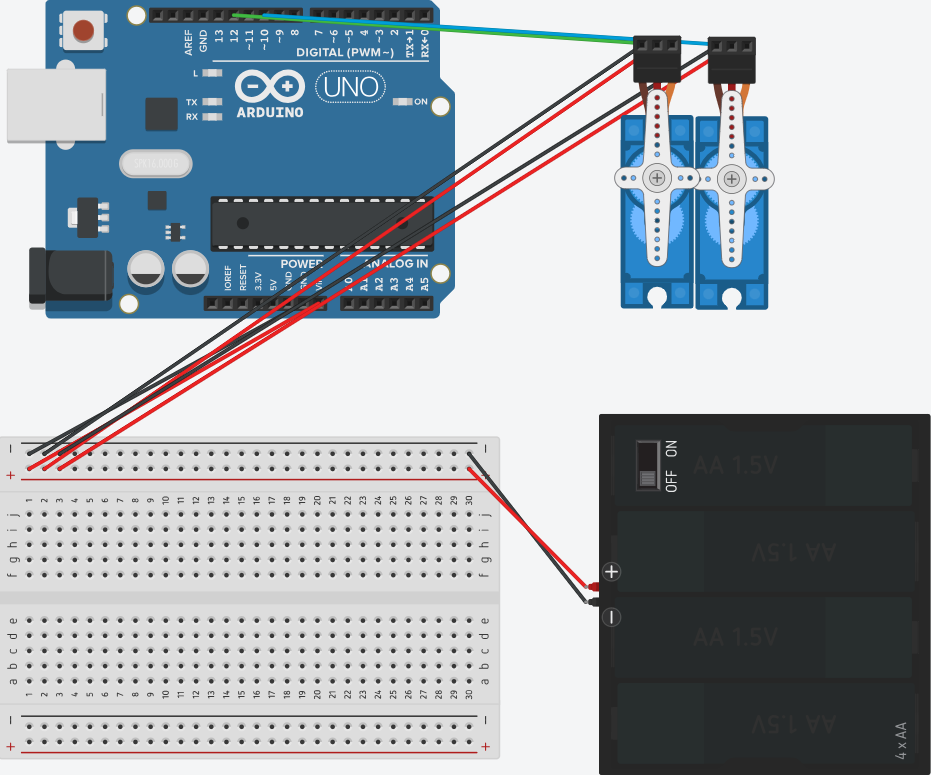

# ButterflyRobot
A very simple Arduino nano-based, portable, battery-powered device to simulate butterfly wing movements.

The device was built with the followign parts (~25 euros):
- An Arduino Nano Every:
  - https://store.arduino.cc/products/arduino-nano-every
- Two 2g Ultra-Micro servos (3V-5V) (glued longitudinally) with linear turning element:
  - https://www.componentshop.co.uk/2g-ultra-micro-servo-3v-4-8v.html
- A 4-AA battery holder with on/off switch:
  - https://www.amazon.de/-/en/gp/product/B0761TSC32/ref=ppx_yo_dt_b_asin_title_o01_s01?ie=UTF8&th=1
- Four rechargeable 1.2 Volt 2400 mAh in series.
- A few jumper wires.
- A small PCB board.
- A high resolution two-sided colour printout of butterfly wings.

## Showcasing the device during behavioural trials in outdoor arenas

  

## Circuit diagram of the device built with tinkercad

  

